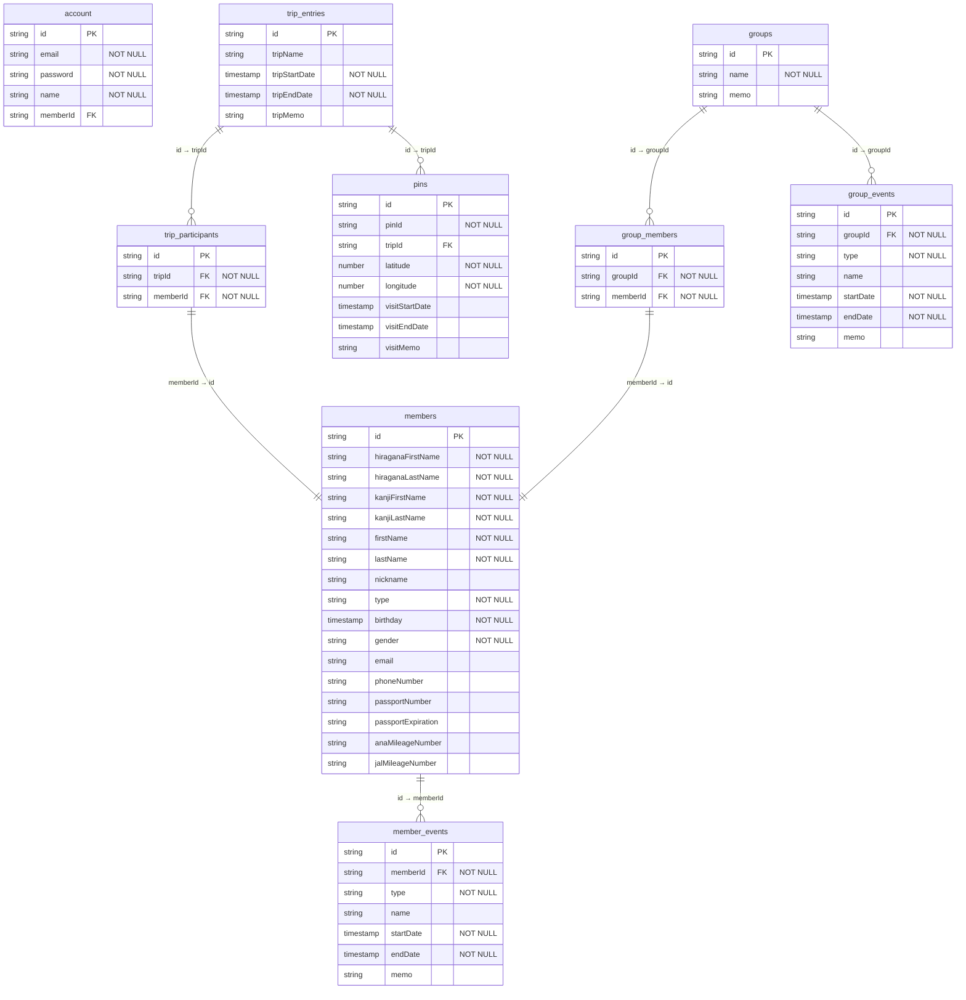

# ER図

```mermaid
erDiagram
    account {
        string id PK
        string email "NOT NULL"
        string password "NOT NULL"
        string name "NOT NULL"
        string memberId FK
    }
    trip_entries {
        string id PK
        string tripName
        timestamp tripStartDate "NOT NULL"
        timestamp tripEndDate "NOT NULL"
        string tripMemo
    }
    trip_participants {
        string id PK
        string tripId FK "NOT NULL"
        string memberId FK "NOT NULL"
    }
    pins {
        string id PK
        string pinId "NOT NULL"
        string tripId FK
        number latitude "NOT NULL"
        number longitude "NOT NULL"
        timestamp visitStartDate
        timestamp visitEndDate
        string visitMemo
    }
    groups {
        string id PK
        string name "NOT NULL"
        string memo
    }
    group_members {
        string id PK
        string groupId FK "NOT NULL"
        string memberId FK "NOT NULL"
    }
    group_events {
        string id PK
        string groupId FK "NOT NULL"
        string type "NOT NULL"
        string name
        timestamp startDate "NOT NULL"
        timestamp endDate "NOT NULL"
        string memo
    }
    members {
        string id PK
        string hiraganaFirstName "NOT NULL"
        string hiraganaLastName "NOT NULL"
        string kanjiFirstName "NOT NULL"
        string kanjiLastName "NOT NULL"
        string firstName "NOT NULL"
        string lastName "NOT NULL"
        string nickname
        string type "NOT NULL"
        timestamp birthday "NOT NULL"
        string gender "NOT NULL"
        string email
        string phoneNumber
        string passportNumber
        string passportExpiration
        string anaMileageNumber
        string jalMileageNumber
    }
    member_events {
        string id PK
        string memberId FK "NOT NULL"
        string type "NOT NULL"
        string name
        timestamp startDate "NOT NULL"
        timestamp endDate "NOT NULL"
        string memo
    }

    trip_entries ||--o{ trip_participants : "id → tripId"
    trip_participants ||--|| members : "memberId → id"
    members ||--o{ member_events : "id → memberId"
    trip_entries ||--o{ pins : "id → tripId"
    groups ||--o{ group_members : "id → groupId"
    group_members ||--|| members : "memberId → id"
    groups ||--o{ group_events : "id → groupId"
```
