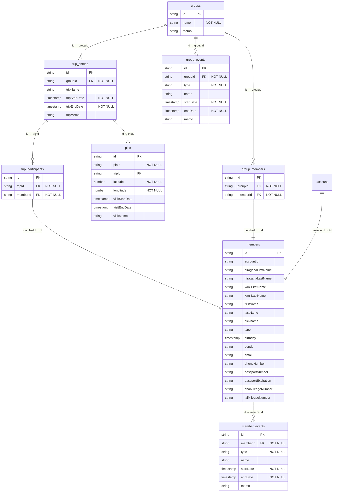

# ER図

```mermaid
erDiagram
    trip_entries {
        string id PK
        string groupId FK "NOT NULL"
        string tripName
        timestamp tripStartDate "NOT NULL"
        timestamp tripEndDate "NOT NULL"
        string tripMemo
    }
    trip_participants {
        string id PK
        string tripId FK "NOT NULL"
        string memberId FK "NOT NULL"
    }
    pins {
        string id PK
        string pinId "NOT NULL"
        string tripId FK
        number latitude "NOT NULL"
        number longitude "NOT NULL"
        timestamp visitStartDate
        timestamp visitEndDate
        string visitMemo
    }
    groups {
        string id PK
        string name "NOT NULL"
        string memo
    }
    group_members {
        string id PK
        string groupId FK "NOT NULL"
        string memberId FK "NOT NULL"
    }
    group_events {
        string id PK
        string groupId FK "NOT NULL"
        string type "NOT NULL"
        string name
        timestamp startDate "NOT NULL"
        timestamp endDate "NOT NULL"
        string memo
    }
    members {
        string id PK
        string accountId
        string hiraganaFirstName
        string hiraganaLastName
        string kanjiFirstName
        string kanjiLastName
        string firstName
        string lastName
        string nickname
        string type
        timestamp birthday
        string gender
        string email
        string phoneNumber
        string passportNumber
        string passportExpiration
        string anaMileageNumber
        string jalMileageNumber
    }
    member_events {
        string id PK
        string memberId FK "NOT NULL"
        string type "NOT NULL"
        string name
        timestamp startDate "NOT NULL"
        timestamp endDate "NOT NULL"
        string memo
    }

    trip_entries ||--o{ trip_participants : "id → tripId"
    trip_participants ||--|| members : "memberId → id"
    members ||--o{ member_events : "id → memberId"
    trip_entries ||--o{ pins : "id → tripId"
    groups ||--o{ group_members : "id → groupId"
    group_members ||--|| members : "memberId → id"
    groups ||--o{ group_events : "id → groupId"
    groups ||--o{ trip_entries : "id → groupId"
    account ||--|| members : "memberId → id"
```
