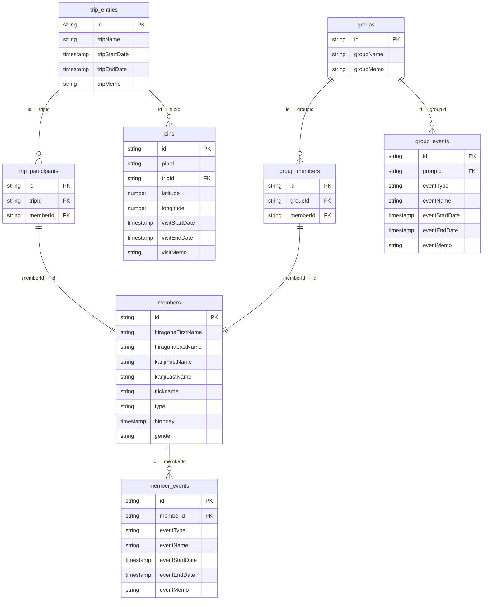

# ER図

```mermaid
erDiagram
    trip_entries {
        string id PK
        string tripName
        timestamp tripStartDate
        timestamp tripEndDate
        string tripMemo
    }
    trip_participants {
        string id PK
        string tripId FK
        string memberId FK
    }
    pins {
        string id PK
        string pinId
        string tripId FK
        number latitude
        number longitude
        timestamp visitStartDate
        timestamp visitEndDate
        string visitMemo
    }
    groups {
        string id PK
        string groupName
        string groupMemo
    }
    group_members {
        string id PK
        string groupId FK
        string memberId FK
    }
    group_events {
        string id PK
        string groupId FK
        string eventType
        string eventName
        timestamp eventStartDate
        timestamp eventEndDate
        string eventMemo
    }
    members {
        string id PK
        string hiraganaFirstName
        string hiraganaLastName
        string kanjiFirstName
        string kanjiLastName
        string nickname
        string type
        timestamp birthday
        string gender
    }
    member_events {
        string id PK
        string memberId FK
        string eventType
        string eventName
        timestamp eventStartDate
        timestamp eventEndDate
        string eventMemo
    }

    trip_entries ||--o{ trip_participants : "id → tripId"
    trip_participants ||--|| members : "memberId → id"
    members ||--o{ member_events : "id → memberId"
    trip_entries ||--o{ pins : "id → tripId"
    groups ||--o{ group_members : "id → groupId"
    group_members ||--|| members : "memberId → id"
    groups ||--o{ group_events : "id → groupId"
```
