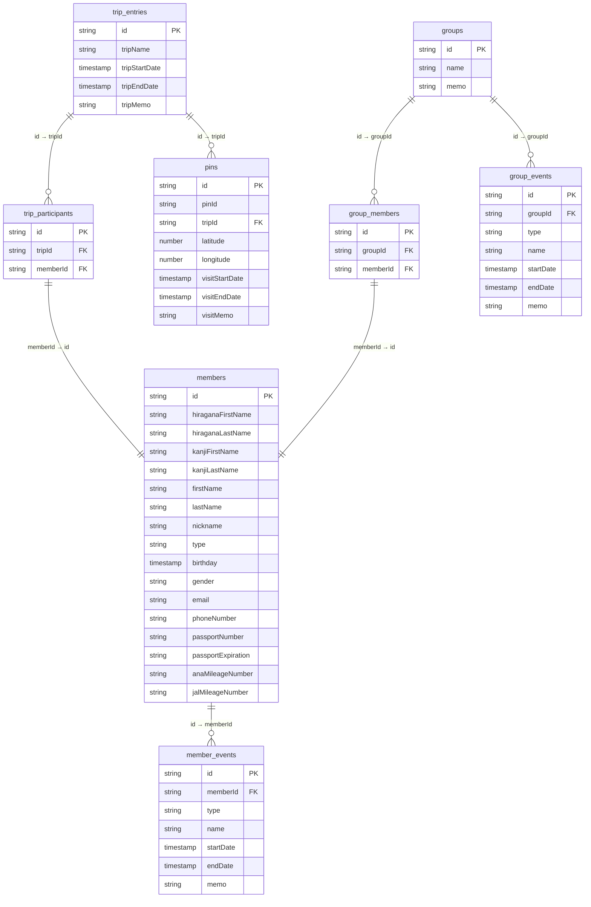

# ER図

```mermaid
erDiagram
    trip_entries {
        string id PK
        string tripName
        timestamp tripStartDate
        timestamp tripEndDate
        string tripMemo
    }
    trip_participants {
        string id PK
        string tripId FK
        string memberId FK
    }
    pins {
        string id PK
        string pinId
        string tripId FK
        number latitude
        number longitude
        timestamp visitStartDate
        timestamp visitEndDate
        string visitMemo
    }
    groups {
        string id PK
        string name
        string memo
    }
    group_members {
        string id PK
        string groupId FK
        string memberId FK
    }
    group_events {
        string id PK
        string groupId FK
        string type
        string name
        timestamp startDate
        timestamp endDate
        string memo
    }
    members {
        string id PK
        string hiraganaFirstName
        string hiraganaLastName
        string kanjiFirstName
        string kanjiLastName
        string firstName
        string lastName
        string nickname
        string type
        timestamp birthday
        string gender
        string email
        string phoneNumber
        string passportNumber
        string passportExpiration
        string anaMileageNumber
        string jalMileageNumber
    }
    member_events {
        string id PK
        string memberId FK
        string type
        string name
        timestamp startDate
        timestamp endDate
        string memo
    }

    trip_entries ||--o{ trip_participants : "id → tripId"
    trip_participants ||--|| members : "memberId → id"
    members ||--o{ member_events : "id → memberId"
    trip_entries ||--o{ pins : "id → tripId"
    groups ||--o{ group_members : "id → groupId"
    group_members ||--|| members : "memberId → id"
    groups ||--o{ group_events : "id → groupId"
```
