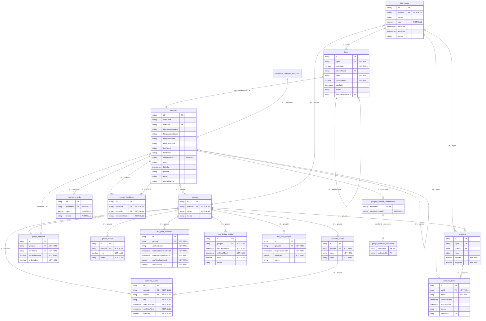

# ER図

## カレンダー関連モデル（実装予定）

[ユーザーストーリー23〜25](user_stories.md)と[ADR-004](adr.md#adr-004-グループの予定と個人の外部予定を分離して扱う)に対応する設計を示す。上図の`calendar_events`、`calendar_labels`、`google_calendar_connections`、`google_calendar_selections`は実装予定であり、現在のFirestore・SQLiteの物理スキーマへ追加済みであることを意味しない。

| エンティティ | 役割 | 保存・公開範囲 |
| --- | --- | --- |
| `calendar_events` | グループに属する予定のタイトル・期間・終日区分・色ラベル | オンラインはFirestoreで所属メンバーに共有、オフラインはSQLiteで端末内のみ |
| `calendar_labels` | 誰に関係する予定かを表すグループごとの名前と色 | 予定と同じ保存・公開範囲 |
| `google_calendar_connections` | 本人と連携先Googleアカウントの対応 | オンラインのみ、連携した本人だけが読み書き可能 |
| `google_calendar_selections` | 本人が表示対象として選択したGoogleカレンダーのID | オンラインのみ、連携した本人だけが読み書き可能 |

- `calendar_events`は日付単位の予定であり、年表セルのメモである既存の`group_events`・`member_events`とは別に管理する。
- 予定は必ず1つのグループと1つの色ラベルに属する。予定の`groupId`とラベルの`groupId`は一致させる。タイトルは空にできず、終了日時は開始日時より前にできない。終日・複数日の予定も開始と終了の組で表す。
- 色ラベルの名前は特定のメンバーや「家族全員」などを表し、予定の登録者とは独立して指定する。共通ラベルも扱うため、ラベルと`members`の直接参照は必須にしない。ラベル変更・削除時も予定の参照整合性を維持する。
- Googleカレンダー連携の`memberId`は連携した本人を表す。グループへの外部キーを持たせず、グループ切替にかかわらず本人の設定を利用する。表示対象は`memberId`と`calendarId`の組で一意とし、連携解除時に連携設定と表示対象を削除する。
- 外部予定の本文・期間・連携元カレンダー名はGoogleカレンダーから取得して表示し、`calendar_events`へ保存しない。連携解除でもGoogleカレンダーとグループの予定は削除しない。認証情報の安全な保存方法は実装時に検討し、この業務モデルにはトークンや秘密情報を含めない。
- オフラインでは予定と色ラベルをバックアップ・復元の対象に含める。Googleカレンダー連携設定と表示対象はオフラインの保存・復元対象に含めない。

## オフラインモードの物理スキーマ

上図は共通の業務モデルとFirestoreの関連を示す。SQLiteの物理定義と制約・indexは[`offline_schema.drift`](../lib/infrastructure/database/offline_schema.drift)、保存形式とマイグレーションの方針は[ADR-002](adr.md#adr-002-オフラインデータをsqliteへ保存する)を参照。
