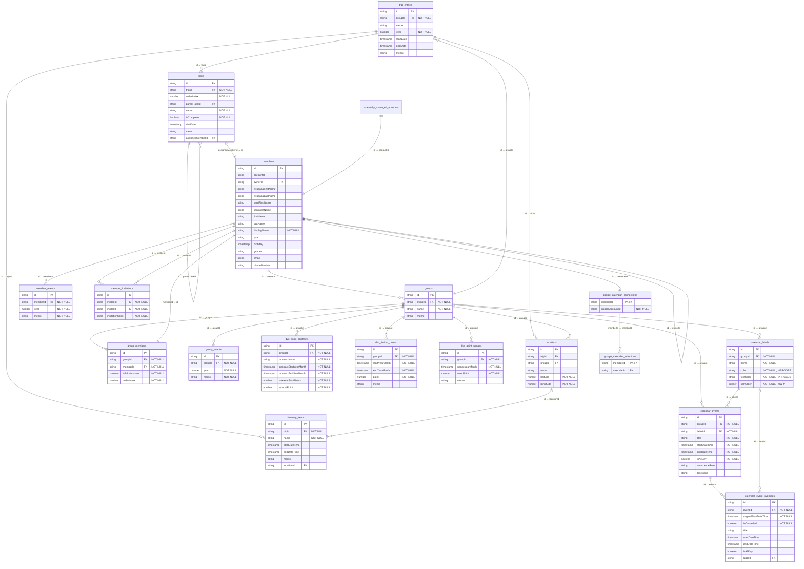

# ER図

## オフラインモードの物理スキーマ

上図は共通の業務モデルとFirestoreの関連を示す。SQLiteの物理定義と制約・indexは[`offline_schema.drift`](../lib/infrastructure/database/offline_schema.drift)、保存形式とマイグレーションの方針は[ADR-002](adr.md#adr-002-オフラインデータをsqliteへ保存する)を参照。

## 繰り返し予定の保存と展開

- 繰り返しルールは日・週・月・年のRRULEを保存する。正の間隔、週の複数曜日、月の日付または第1〜第5／最終の曜日、初回を含む正の回数、終了日を含むUNTILを扱う。COUNTとUNTILの同時指定、開始日前の終了条件、開始日と一致しない曜日・月の日付指定、未対応のプロパティは拒否する。
- 時刻付き系列の開始・終了は実時刻、`timeZone`はIANA IDとして保存する。時刻付きのUNTILはUTC日時形式に限定し、実時刻で比較する。終日はUTCの年月日だけを保存・比較し、終了日を含める。毎月31日や毎年2月29日、夏時間で存在しない時刻はその回をスキップし、回数に含めない。重複する時刻は早い方を採用し、初回に遅い方を指定した入力は保存前に拒否する。各回の終了は初回の経過時間を保つ。
- 個別回のキーは元の開始日時（終日は元の日付）とする。個別回だけの移動ではキーを維持し、系列の日時変更ではキーを追従させて個別予定の実日時は維持する。取消しにはキーだけを保存し、変更にはタイトル・期間・終日区分・色ラベルをすべて保存する。新規の個別変更は対象の回が系列に存在することを確認する。系列変更によって条件外になった保存済みの個別変更は維持する。重複キーと別グループの色ラベルは拒否し、系列のルールと個別回は同じ保存要求で置き換える。
- Firestoreでは`calendar_events`の親ドキュメント内に、`overrides`を色ラベルID別の配列として保存する。配列内に色ラベルIDを保存せず、読取時にそのキーを各回へ割り当てる。取消しの元開始日時は`cancelledOccurrences`に保存する。`referencedLabelIds`は親と上書きが参照するラベルの重複なし一覧で、各ラベルの`eventCount`はそのラベルを参照する系列数を表す。親・上書き・全ラベルの参照数を同じトランザクションで更新する。Firestoreのトランザクション制限を超える変更は全体が失敗し、変更前を維持する。
- SQLiteはスキーマバージョン5の`calendar_events`と`calendar_event_overrides`を単一トランザクションで保存する。親と元開始日時の組を主キーにし、グループ・ラベルの外部キー制約を維持する。親の削除で個別回も削除する。バックアップ・復元には両テーブルを含め、復元確認前に繰り返し設定と上書きの整合性を検証する。旧スキーマは移行や再作成を行わず拒否する。
- 各回は保存せず、月表示と前後の日付に重なる回だけを展開する。グループの全系列と保存済みの上書きを取得するため、別月へ移動した回も変更後の期間に表示し、元の回は表示しない。月切替では取得済みの系列から再展開する。登録・編集画面でプリセットまたはカスタムの繰り返しを設定し、設定の要約を表示する。通常の回の編集・削除では「この予定のみ」「この予定とこれ以降」「すべての予定」を選択する。保存済みの個別変更がある回は、日時や曜日の一致にかかわらず、その回のみ編集・削除でき、繰り返し設定や系列への反映は選べない。「個別変更をリセット」では戻り先の日時を確認し、対象の上書きだけを削除して系列の日時・タイトル・色ラベル・終日区分に戻す。リセット後は通常の回として系列変更を選べる。個別回は元開始日時をキーに上書きまたは取消しを保存する。「これ以降」は元開始日時を境に元系列を直前で終了し、新系列を同じトランザクションで保存する。初回からの変更は元系列を置き換える。系列全体の日時変更は選択回からの差分を初回へ適用する。繰り返しの曜日・月の日付条件を変更せず日付を移動した場合は、保存する初回へ条件を追従させる。複数曜日は同じ曜日差で移動し、終了条件と分割後の残り回数は維持する。系列変更・分割でも個別変更の内容と取消しを維持し、元の予定日時を境に前後の系列へ引き継ぐ。系列の日時変更では照合キーだけを追従させ、繰り返し条件から外れた個別変更も保持する。繰り返しを解除した範囲の個別予定は単発として同じトランザクションで保存する。系列削除は元の予定日時を基準に対象範囲の個別予定も削除する。確認画面で変更は個別維持、削除は個別も削除と明示する。リセット時に現在の系列に対応する回がなければ、個別予定が削除されることを確認する。保存時に元系列の内容を照合し、他の編集と競合した場合は全体を拒否して再取得を案内する。
