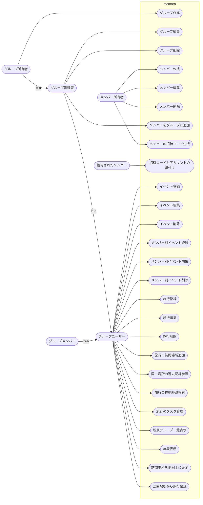

# ユースケース図

## ユースケース一覧

### グループ管理

| UC ID | ユースケース | ゴール               |
| ----- | ------------ | -------------------- |
| G1    | グループ作成 | 新しいグループを登録 |
| G2    | グループ編集 | 名称などを更新       |
| G3    | グループ削除 | グループを削除       |

### メンバー管理

| UC ID | ユースケース                   | ゴール                                           |
| ----- | ------------------------------ | ------------------------------------------------ |
| M1    | メンバー作成                   | 新しいメンバーを登録                             |
| M2    | メンバー編集                   | メンバー名を更新                                 |
| M3    | メンバー削除                   | メンバーを削除                                   |
| M4    | メンバーをグループに追加       | メンバーをn個以上のグループへ紐づけ              |
| M5    | メンバーの招待コード生成       | 招待コードが発行される                           |
| M6    | 招待コードとアカウントの紐付け | 招待先コード生成元のメンバーとアカウントが紐づく |

### グループイベント管理

| UC ID | ユースケース | ゴール                         |
| ----- | ------------ | ------------------------------ |
| GE1   | イベント登録 | グループのイベントを年表に追加 |
| GE2   | イベント編集 | イベント情報を更新             |
| GE3   | イベント削除 | イベントを年表から除去         |

### メンバー別イベント管理
| UC ID | ユースケース           | ゴール                               |
| ----- | ---------------------- | ------------------------------------ |
| ME1   | メンバー別イベント登録 | 特定メンバーのイベントを年表に追加   |
| ME2   | メンバー別イベント編集 | 特定メンバーのイベント情報を更新     |
| ME3   | メンバー別イベント削除 | 特定メンバーのイベントを年表から除去 |

### 旅行管理

| UC ID | ユースケース           | ゴール                                   |
| ----- | ---------------------- | ---------------------------------------- |
| T1    | 旅行登録               | 旅行（期間・メモ）を年表に追加           |
| T2    | 旅行編集               | 旅行情報を更新                           |
| T3    | 旅行削除               | 旅行を年表から除去                       |
| T4    | 旅行の訪問場所を追加   | 旅行に訪問場所を紐づけ、期間・メモを保存 |
| T5    | 同一場所の過去記録参照 | 特定の場所に紐づく旅行履歴を一覧表示     |
| T6    | 旅行の移動経路検索     | 旅行の移動経路を検索する                 |
| T7    | 旅行のタスク管理       | 旅行に紐づくタスクを登録・編集・削除     |

### 年表表示

| UC ID | ユースケース         | ゴール                                                         |
| ----- | -------------------- | -------------------------------------------------------------- |
| GT1   | 所属グループ一覧表示 | 自分が属するグループを確認                                     |
| GT2   | 年表表示             | 選択グループの旅行、イベント、メンバー別イベントを時系列で表示 |

### 地図表示
| UC ID | ユースケース           | ゴール                                     |
| ----- | ---------------------- | ------------------------------------------ |
| MAP1  | 訪問場所を地図上に表示 | 所属グループの旅行の訪問場所を地図上に表示 |
| MAP2  | 訪問場所から旅行確認   | 地図上の訪問場所から旅行情報を確認/編集    |

## ユースケース図（mermaid）

