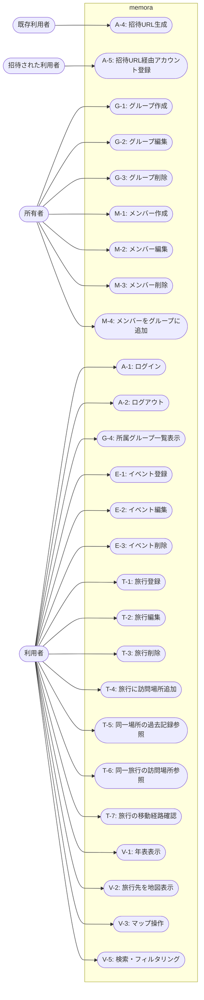

# ユースケース図

## ユースケース一覧 — 機能ブロックごとに整理

### 1. 認証・セキュリティ

| UC ID | ユースケース | 主アクター | ゴール/完了条件 |
|-------|-------------|------------|----------------|
| A-1 | ログイン | 利用者 | Google OAuth または メール＋パスワードで認証し、セッション確立 |
| A-2 | ログアウト | 利用者 | 現行セッションを終了し、ログイン画面へ戻る |
| A-3 | 招待 URL 生成 | 既存利用者 | 招待リンクを発行し、24 h 有効期限を設定 |
| A-4 | 招待 URL 経由アカウント登録 | 招待された利用者 | 招待先グループに紐づく形でアカウント作成 |

### 2. 基本データ管理

#### グループ管理

| UC ID | ユースケース | 主アクター | ゴール |
|-------|-------------|------------|-------|
| G-1 | グループ作成 | 所有者 | 新しいグループを登録 |
| G-2 | グループ編集 | 所有者 | 名称などを更新 |
| G-3 | グループ削除 | 所有者 | グループと関連イベント/旅行を削除 |
| G-4 | 所属グループ一覧表示 | 利用者 | 自分が属するグループを確認 |

#### メンバー管理

| UC ID | ユースケース | 主アクター | ゴール |
|-------|-------------|------------|-------|
| M-1 | メンバー作成 | 所有者 | 新しいメンバーを登録 |
| M-2 | メンバー編集 | 所有者 | メンバー名を更新 |
| M-3 | メンバー削除 | 所有者 | メンバーと関連イベント/旅行を削除 |
| M-4 | メンバーをグループに追加 | 所有者 | 既存メンバーを1つ以上のグループへ紐づけ |

### 3. イベント管理

| UC ID | ユースケース | 主アクター | ゴール |
|-------|-------------|------------|-------|
| E-1 | イベント登録 | 利用者 | 個人／グループのイベントを年表に追加 |
| E-2 | イベント編集 | 所有者 | イベント情報を更新 |
| E-3 | イベント削除 | 所有者 | イベントを年表から除去 |

### 4. 旅行管理

| UC ID | ユースケース | 主アクター | ゴール |
|-------|-------------|------------|-------|
| T-1 | 旅行登録 | 利用者 | 旅行（期間・参加者・メモ）を年表に追加 |
| T-2 | 旅行編集 | 利用者 | 旅行情報を更新 |
| T-3 | 旅行削除 | 利用者 | 旅行を年表から除去 |
| T-4 | 旅行に訪問場所追加 | 利用者 | 旅行に訪問場所を紐づけ、期間・メモを保存 |
| T-5 | 同一場所の過去記録参照 | 利用者 | 特定の場所に紐づく旅行履歴を一覧表示 |
| T-6 | 同一旅行の訪問場所参照 | 利用者 | 同一の旅行に紐づく訪問場所をマップ上に表示 |
| T-7 | 旅行の移動経路確認 | 利用者 | 旅行の移動経路を確認する |

### 5. 表示・UI／検索

| UC ID | ユースケース | 主アクター | ゴール |
|-------|-------------|------------|-------|
| V-1 | 年表表示 | 利用者 | 選択グループまたはトップページのイベント・旅行を時系列で表示 |
| V-2 | 旅行先を地図表示 | 利用者 | 旅行に登録された位置情報をピンで可視化 |
| V-3 | マップ操作 | 利用者 | ピンチ／ドラッグによる拡大縮小・移動 |
| V-4 | 検索・フィルタリング | 利用者 | キーワード・日付範囲・参加者で絞り込み |

## ユースケース図（mermaid）

