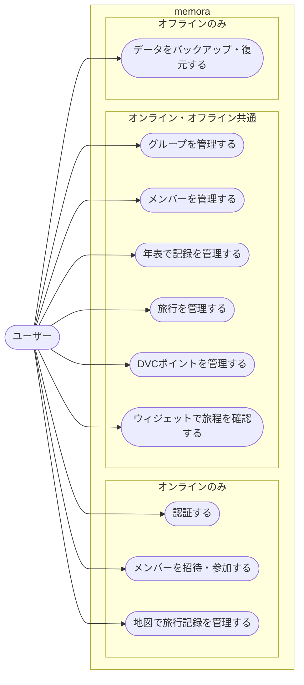

# ユースケース図

主要な利用目的と利用できるアプリモードを示す。詳細な仕様と受け入れ条件は[ユーザーストーリー](user_stories.md)を参照。

```mermaid
graph LR
    User([ユーザー])

    subgraph memora
        direction TB

        subgraph Online[オンラインのみ]
            Auth([認証する])
            Invite([メンバーを招待・参加する])
            Map([地図で旅行記録を管理する])
        end

        subgraph Common[オンライン・オフライン共通]
            Group([グループを管理する])
            Member([メンバーを管理する])
            Timeline([年表で記録を管理する])
            Trip([旅行を管理する])
            Dvc([DVCポイントを管理する])
            Widget([ウィジェットで旅程を確認する])
        end

        subgraph Offline[オフラインのみ]
            Backup([データをバックアップ・復元する])
        end
    end

    User --> Auth
    User --> Invite
    User --> Map
    User --> Group
    User --> Member
    User --> Timeline
    User --> Trip
    User --> Dvc
    User --> Widget
    User --> Backup
```
