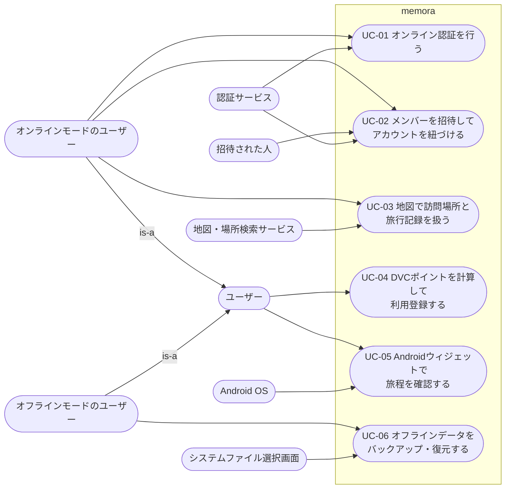

# ユースケース

## この資料の位置づけ

[ユーザーストーリー](user_stories.md)を要求管理の基本単位かつ要求の正本とする。ユースケースは、ユーザーストーリーだけでは主体間のやり取り、外部システムとの境界、重要な業務ルール、代替・失敗フローを把握しにくい場合に限って補足する。

次のいずれかに該当するユーザーストーリーを、ユースケースで掘り下げる。

- 複数の利用者や外部システムが関与する
- 複数段階の処理や、通常とは異なる重要なフローがある
- 複数機能をまたぐ業務ルールや計算規則がある
- 失敗時のデータ保護や復旧方法が利用者の目的達成に影響する

単一の利用者が行う単純な登録・参照・更新・削除、画面表示、画面遷移は、ユーザーストーリーの受け入れ条件で管理し、ユースケースとして重複管理しない。要求を変更するときは先にユーザーストーリーを更新し、該当するユースケースがある場合だけ本資料も更新する。

## 対象ユースケース

| UC ID | 対応するユーザーストーリー | ユースケース | 複雑性 |
| --- | --- | --- | --- |
| UC-01 | 1 | オンライン認証を行う | 認証サービスと連携し、複数の認証方式と失敗フローを扱う |
| UC-02 | 2 | メンバーを招待してアカウントを紐づける | 招待者と招待された人が別々の時点で操作し、招待コードを引き継ぐ |
| UC-03 | 8、11、12 | 地図で訪問場所と旅行記録を扱う | 地図・場所検索サービスと連携し、グループ、場所、旅行を横断する |
| UC-04 | 16〜18 | DVCポイントを計算して利用登録する | 契約ごとのユースイヤー、有効期限、期間限定ポイント、消化順を組み合わせる |
| UC-05 | 20 | Androidウィジェットで旅程を確認する | アプリとAndroidウィジェットが別の実行経路で設定と旅程表示を連携する |
| UC-06 | 22 | オフラインデータをバックアップ・復元する | 外部ファイル、暗号化、入力検証、全件置換、失敗時の復旧を扱う |

## 対象外のユーザーストーリー

| ユーザーストーリー | ユースケースを作成しない理由 |
| --- | --- |
| 3〜7、9、10、13〜15、19 | 単一利用者のデータ管理、表示、検索、画面遷移であり、受け入れ条件からフローを把握できる |
| 21 | アプリモード全体の利用条件であり、個別の利用フローではない。詳細な設計判断は[ADR-001](adr.md#adr-001-アプリモードごとにcomposition-rootで依存実装を選択する)と[ADR-004](adr.md#adr-004-オンライン版とオフライン版を別のandroidアプリとして配布する)で管理する |

## ユースケース図

```mermaid
graph LR
    User([ユーザー])
    OnlineUser([オンラインモードのユーザー])
    OfflineUser([オフラインモードのユーザー])
    InvitedPerson([招待された人])
    AuthService([認証サービス])
    MapService([地図・場所検索サービス])
    Android([Android OS])
    FileProvider([システムファイル選択画面])

    OnlineUser -->|is-a| User
    OfflineUser -->|is-a| User

    subgraph memora
        UC01([UC-01 オンライン認証を行う])
        UC02([UC-02 メンバーを招待して<br/>アカウントを紐づける])
        UC03([UC-03 地図で訪問場所と<br/>旅行記録を扱う])
        UC04([UC-04 DVCポイントを計算して<br/>利用登録する])
        UC05([UC-05 Androidウィジェットで<br/>旅程を確認する])
        UC06([UC-06 オフラインデータを<br/>バックアップ・復元する])
    end

    OnlineUser --> UC01
    AuthService --> UC01
    OnlineUser --> UC02
    InvitedPerson --> UC02
    AuthService --> UC02
    OnlineUser --> UC03
    MapService --> UC03
    User --> UC04
    User --> UC05
    Android --> UC05
    OfflineUser --> UC06
    FileProvider --> UC06
```

## UC-01: オンライン認証を行う

- 対応するユーザーストーリー: 1
- 主アクター: オンラインモードのユーザー
- 支援アクター: 認証サービス
- 事前条件: オンラインモードのアプリを利用している
- 成功時保証: 認証済みのユーザーとしてオンラインモードの機能を利用できる

### 基本フロー

1. ユーザーはメールアドレスとパスワード、またはGoogleアカウントによる認証を選択する。
2. アプリは入力された認証情報を認証サービスへ渡す。
3. 認証サービスは認証結果を返す。
4. アプリは認証済み状態を確立し、ユーザーがオンラインモードの機能を利用できるようにする。
5. ユーザーがログアウトすると、アプリは認証済み状態を解除する。

### 代替・失敗フロー

- 新規登録を選択した場合、アプリは有効なメールアドレスと十分な強度のパスワードだけを受け付ける。
- 認証情報が無効な場合、アプリは認証済み状態へ移行せず、ログイン失敗を通知する。
- 認証済み状態を確認できない場合、保護された記録へアクセスさせない。

## UC-02: メンバーを招待してアカウントを紐づける

- 対応するユーザーストーリー: 2
- 主アクター: 招待者、招待された人
- 支援アクター: 認証サービス
- 事前条件: 招待者が、招待対象となるメンバーを管理している
- 成功時保証: 招待された人のアカウントが、招待対象のメンバーに紐づく

### 基本フロー

1. 招待者は対象メンバーの招待コードを生成する。
2. 招待者は招待された人へ招待コードを伝える。
3. 招待された人はアカウント登録時に招待コードを入力する。
4. アプリは招待コードと対象メンバーを確認する。
5. アプリは登録されたアカウントを対象メンバーへ紐づける。

### 代替・失敗フロー

- 招待コードが存在しない、または有効期限を過ぎている場合、アプリはアカウントをメンバーへ紐づけない。
- アカウント登録に失敗した場合、アプリはメンバーとの紐づけを成立させない。

## UC-03: 地図で訪問場所と旅行記録を扱う

- 対応するユーザーストーリー: 8、11、12
- 主アクター: オンラインモードのユーザー
- 支援アクター: 地図・場所検索サービス
- 事前条件: ユーザーが1件以上のグループに所属している
- 成功時保証: 選択中のグループまたは旅行の訪問場所と、それに紐づく旅行記録を地図から確認できる

### 基本フロー

1. ユーザーは表示対象のグループまたは旅行を選ぶ。
2. アプリは対象に紐づく訪問場所を取得し、地図上へ表示する。
3. ユーザーは場所検索、または地図上の位置指定によって旅行へ訪問場所を追加する。
4. ユーザーが地図上の訪問場所を選ぶと、アプリは同じ場所に紐づく過去の旅行を表示する。
5. ユーザーが旅行を選ぶと、アプリは旅行情報を表示し、終了後は選択中の地図へ戻す。

### 代替・失敗フロー

- 所属グループが1件だけの場合、アプリはグループ選択を省略する。
- 所属グループが複数ある場合、アプリは選択されたグループの場所だけを表示する。
- オフラインモードでは本ユースケースを開始できない。

## UC-04: DVCポイントを計算して利用登録する

- 対応するユーザーストーリー: 16〜18
- 主アクター: ユーザー
- 事前条件: 選択中のグループに1件以上のDVCポイント契約が登録されている
- 成功時保証: 選択月の利用可能ポイントと内訳を確認でき、利用登録後の残数が一貫して再計算される

### 基本フロー

1. アプリは選択中のグループの契約、期間限定ポイント、利用履歴を取得する。
2. アプリは契約ごとのユースイヤーから各ポイントの有効期間を求める。
3. アプリは選択月に有効な通常ポイントと期間限定ポイントを合算する。
4. アプリは選択月までの利用登録を、有効期限が早いポイントから順に割り当てる。
5. アプリは月ごとの利用可能ポイント、利用登録済みポイント、契約ごとの内訳を表示する。
6. ユーザーは利用ポイント数とメモを登録する。
7. アプリは利用月以降を再計算し、利用可能ポイントと利用登録済みポイントを更新する。

### 代替・失敗フロー

- 選択月に有効でない通常ポイントや期間限定ポイントは、利用可能ポイントへ含めない。
- 契約ごとにユースイヤーが異なる場合、それぞれの有効期間を独立して判定してから合算する。
- 通常ポイントと期間限定ポイントが同時に有効な場合、種別ではなく有効期限が早い順に消化する。
- 他グループの契約、期間限定ポイント、利用履歴を計算や表示へ混在させない。

## UC-05: Androidウィジェットで旅程を確認する

- 対応するユーザーストーリー: 20
- 主アクター: ユーザー
- 支援アクター: Android OS
- 事前条件: Androidのホーム画面にウィジェットが配置されている
- 成功時保証: 設定したグループの旅行と旅程を、アプリを開かずに確認できる

### 基本フロー

1. ユーザーはアプリの設定画面で、ウィジェットの表示対象グループを選ぶ。
2. アプリは対象グループの旅行と旅程を取得し、ウィジェット表示用のデータを更新する。
3. Android OSはホーム画面へ、現在日付以降で開始日が最も近い旅行と、開始日時順の旅程を表示する。
4. ユーザーが左右ボタンを押すと、ウィジェットは旅行開始日の順序に従って別の旅行へ切り替える。

### 代替・失敗フロー

- 表示対象グループが未設定の場合、ウィジェットは未設定であることを表示する。
- データ取得や更新に失敗した場合、取得失敗を「旅程なし」として公開せず、再取得可能な状態を維持する。
- アプリとウィジェットで解決済みのアプリモードが一致しない場合、異なるモードのデータを表示しない。

## UC-06: オフラインデータをバックアップ・復元する

- 対応するユーザーストーリー: 22
- 主アクター: オフラインモードのユーザー
- 支援アクター: システムファイル選択画面
- 事前条件: オフラインモードを利用している
- 成功時保証: バックアップでは復元可能な暗号化ファイルが保存され、復元では検証済みデータだけが全件置換される
- 最小保証: バックアップまたは復元に失敗しても、既存のオフラインデータを欠損・不整合にしない

### バックアップの基本フロー

1. ユーザーはバックアップを開始し、パスワードと保存先を指定する。
2. アプリは業務データ、端末内の現在利用者、対象設定を一貫した状態で取得する。
3. アプリは論理バックアップをパスワードで暗号化する。
4. システムファイル選択画面は、指定された保存先へバックアップファイルを保存する。

### 復元の基本フロー

1. ユーザーは復元するバックアップファイルを選び、パスワードを入力する。
2. アプリはファイル形式、バージョン、暗号パラメータを検証してから復号する。
3. アプリは復号した全データと設定の整合性を検証し、置換内容をユーザーへ示す。
4. ユーザーが全件置換に同意する。
5. アプリは復元前の状態を回復できるようにした上で、業務データ、現在利用者、設定を置換する。
6. アプリは画面表示とAndroidウィジェットなどの派生データを復元後の状態へ同期する。

### 代替・失敗フロー

- ファイル形式、バージョン、パスワード、暗号パラメータ、データ整合性のいずれかが不正な場合、既存データを変更せず復元を中止する。
- 全件置換にユーザーが同意しない場合、既存データを変更しない。
- 復元処理が途中で失敗または中断した場合、復元前の業務データ、現在利用者、設定へ回復する。
- 復元後の派生データ同期に失敗した場合、確定済みの復元は取り消さず、次回起動時に同期を再試行する。
